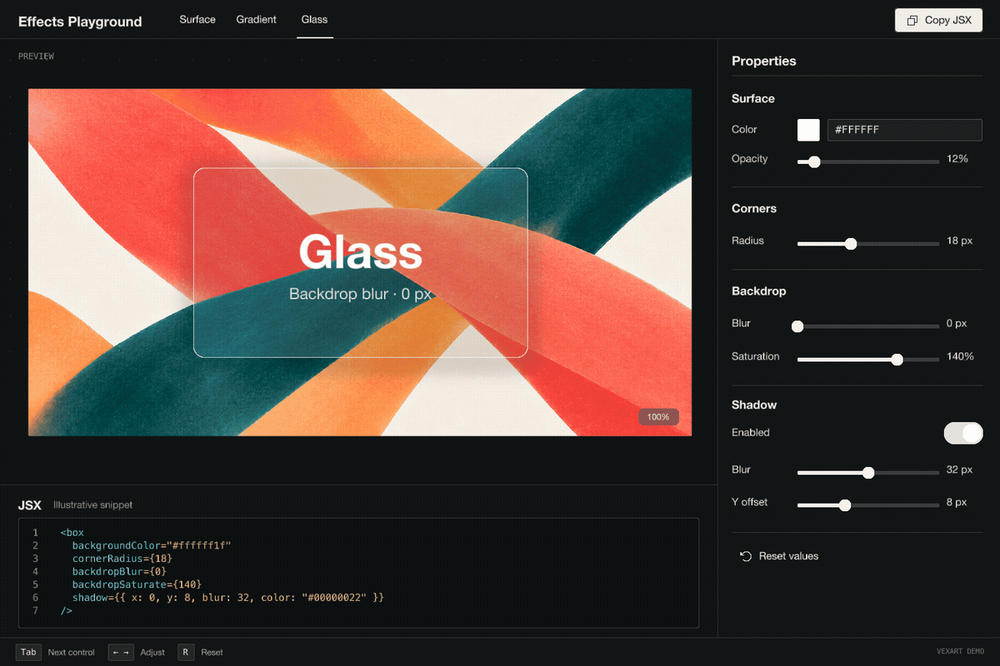
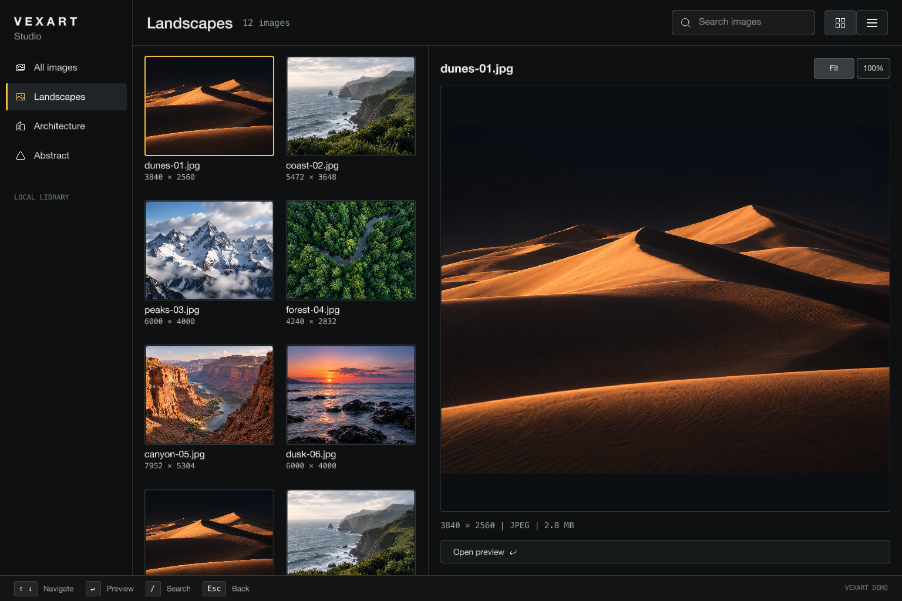
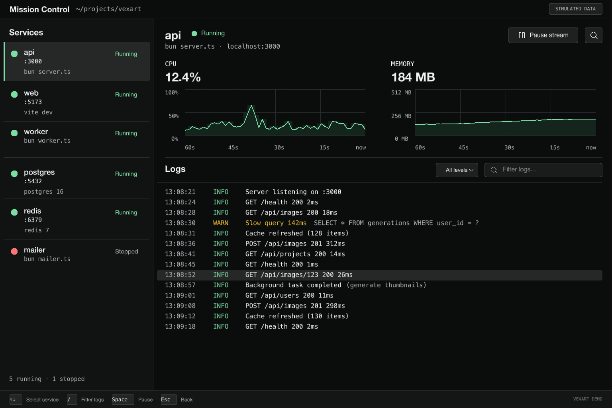

# Vexart

**Pixel-native terminal rendering engine.** Write JSX, get browser-quality UI in your terminal.

Anti-aliased corners. Drop shadows. Linear & radial gradients. Glow effects. Backdrop blur (glassmorphism). Element opacity. Per-corner radius. All rendered as real GPU pixels — not ASCII boxes.



*Live GPU-accelerated backdrop blur (glassmorphism) and fine-grained SolidJS reactivity running natively inside a Kitty-graphics-compatible terminal — rendered as real GPU pixels via WGPU fragment shaders without webviews or ASCII fallbacks.*

```tsx
import { createApp, colors } from "vexart"

await createApp(() => (
  <box
    width="100%"
    height="100%"
    backgroundColor={colors.background}
    alignX="center"
    alignY="center"
  >
    <text color={colors.foreground} fontSize={16}>Hello from Vexart!</text>
  </box>
))
```

---

## Features

- **GPU-accelerated rendering** — WGPU (Metal/Vulkan/DX12) via a single Rust cdylib
- **Pixel-perfect shapes** — SDF anti-aliased rounded rects, circles, lines, Bezier curves
- **JSX components** — SolidJS `createRenderer`; fine-grained reactive updates, no VDOM
- **Incremental layout** — Flexily flexbox (pure JS), reactive tree synced from reconciler; only dirty subtrees recompute
- **Design tokens** — shadcn-compatible dark theme with semantic color, spacing, radius, shadows
- **23 headless components + 2 state factories (25 primitives total)** — Button, Input, Select, Dialog, Combobox, Slider, VirtualList, Table, Diff, createForm, createToaster, and more
- **App router** — Declarative file-system router with `<RouteOutlet>` and `useRouter` via `@vexart/app`
- **Focus management** — Tab/Shift-Tab cycling, per-node keyboard handlers, focus scoping
- **Drop shadows & glow** — declarative `shadow` and `glow` props, rendered via GPU
- **Gradients** — two-stop linear and radial gradients (`from`/`to`)
- **Backdrop filters** — blur, brightness, contrast, saturate, grayscale, invert, sepia, hue-rotate
- **Element opacity** — per-element alpha with isolated compositing
- **Scroll containers** — virtualized lists, programmatic scroll, smooth inertia
- **Animations** — `createTransition` + `createSpring` with 12 easing presets, 30-60 fps adaptive
- **Pointer capture** — drag interactions via `setPointerCapture` / `releasePointerCapture`
- **Form validation** — `createForm()` with sync/async validators, touched/dirty/submitting state
- **Data fetching** — `useQuery` (retry, refetch, interval) and `useMutation` (optimistic + rollback)
- **Syntax highlighting** — Tree-sitter grammars, One Dark and Kanagawa themes
- **Markdown rendering** — inline styling via `<Markdown>` component

---

## Requirements

| Dependency | Version | Notes |
|------------|---------|-------|
| [Bun](https://bun.sh/) | ≥ 1.1.0 | Runtime |
| Rust toolchain | stable | For `cargo build` (native library) |
| Kitty-compatible terminal | — | Kitty, Ghostty, Herdr, or WezTerm |
| tmux (optional) | ≥ 3.4 | Experimental Kitty passthrough from a Kitty, Ghostty, or Herdr outer terminal; see [`docs/tmux.md`](docs/tmux.md) |

> Vexart requires a terminal that supports the [Kitty graphics protocol](https://sw.kovidgoyal.net/kitty/graphics-protocol/). It exits with a clear error on unsupported terminals.
>
> tmux support is experimental and requires user-applied `allow-passthrough all` in tmux. The G-037 physical gate covers Kitty direct and private tmux+SHM runs; offscreen checks are not physical terminal evidence. There is no automatic direct/file fallback or ASCII/cell-based fallback; see [`docs/tmux.md`](docs/tmux.md) for setup and limitations.

## Quick Start

```bash
# 1. Install the beta
bun add vexart@beta
```

```toml
# 2. Configure the universal SolidJS JSX transform in bunfig.toml
preload = ["vexart/solid-plugin"]
```

```bash
# 3. Write your app and run it with the browser condition
bun --conditions=browser run app.tsx
```

```tsx
import { createApp, VoidButton, colors, radius, space } from "vexart"

function App() {
  return (
    <box
      width="100%"
      height="100%"
      backgroundColor={colors.background}
      direction="column"
      alignX="center"
      alignY="center"
      gap={space[4]}
    >
      <box
        backgroundColor={colors.card}
        cornerRadius={radius.lg}
        padding={space[6]}
        direction="column"
        gap={space[2]}
      >
        <text color={colors.foreground} fontSize={16}>Hello from Vexart</text>
        <text color={colors.mutedForeground} fontSize={12}>Browser-quality UI in your terminal</text>
      </box>
      <VoidButton onPress={() => process.exit(0)}>Quit</VoidButton>
    </box>
  )
}

await createApp(() => <App />)
```

`createApp()` is the managed entry point. For advanced integrations, `mountApp()` exposes the async app lifecycle and `mount()` remains the low-level engine alternative when you need to provide your own terminal and input plumbing.

---

## Featured Demos

Vexart powers full-scale, interactive desktop-grade applications running directly within Kitty-graphics-compatible terminals. These flagship demos showcase pixel-native rendering, responsive Flexily layouts, real-time WGPU canvas pipelines, and reactive SolidJS state management without webviews or ASCII fallbacks.

Run them directly from the repository root:

### Vexart Studio

A professional media workstation demonstrating high-resolution image decoding, fluid responsive layouts, search filtering, and modal inspection dialogs.

```bash
bun run demo:studio
```



- **Native Image Pipeline** — High-resolution image decoding and GPU texture upload directly to WGPU render pipelines.
- **Fluid Layout & Filtering** — Responsive Flexily layout with instantaneous search filtering across media collections and grid/list view toggles.
- **Modal Inspection** — Interactive detail inspection dialogs with backdrop dimming and keyboard-driven navigation.

---

### Mission Control

A DevOps telemetry and observability dashboard demonstrating real-time GPU-accelerated 2D `<canvas>` drawing, live waveforms, and high-throughput log streams.

```bash
bun run demo:mission
```



- **GPU-Accelerated 2D `<canvas>`** — Real-time telemetry waveforms and CPU/memory area charts rasterized and composited via WGPU at 60 FPS.
- **Live Waveforms & Telemetry** — High-throughput live log streams, service health status indicators, and interactive metric pause/resume controls.
- **Multi-Panel Layout** — Dense metrics dashboard organized into responsive modular panels with semantic Void design tokens.

---

### Effects Playground

An interactive GPU shader and visual effects laboratory for tuning and generating glassmorphic terminal UI.

```bash
bun run demo:effects
```


- **Real-Time Backdrop Blur (Glassmorphism)** — Dual-pass separable Gaussian blur and multi-layer compositing executed entirely in Rust/WGPU fragment shaders.
- **Dynamic Filter Controls** — Live interactive tuning of backdrop blur radius, saturation, opacity, corner radii, and drop shadow offsets.
- **Live JSX Code Generation** — Instantaneous synthesis of production-ready Vexart JSX props with one-click clipboard export via terminal OSC 52.

---

## Architecture

```
JSX (SolidJS createRenderer)
  → Reconciler syncs reactive Flexily tree (incremental layout)
    → TypeScript walk-tree (render metadata collection)
      → Rust libvexart (WGPU paint + composite + readback + Kitty emit)
        → Terminal
```

The Flexily layout tree is **persistent and reactive** — props and tree structure sync from the SolidJS reconciler. `calculateLayout()` only recomputes dirty subtrees. Rust owns the entire output path: GPU paint → readback → compress → Kitty encoding → terminal write. Zero bytes cross the FFI boundary for presentation. Inside tmux, the same GPU-composited frame is sent through local SHM, Kitty Unicode placeholders, and per-sequence tmux passthrough wrappers. The G-037 physical gate validates Kitty direct and private tmux+SHM presentation; offscreen checks do not establish physical terminal support. `a=f` animation updates are not claimed for the Ghostty 1.3.1 target; see the versioned source note in [`docs/tmux.md`](docs/tmux.md).

Vexart is **not** a cell-based TUI framework. It renders actual pixels using the [Kitty graphics protocol](https://sw.kovidgoyal.net/kitty/graphics-protocol/) — the result looks like a browser running inside your terminal.

### Package layers

| Package | Purpose | Layer |
|---------|---------|-------|
| [`@vexart/app`](docs/packages/app-framework.md) | Managed app framework: router, className mapper, config, CLI helpers | App |
| [`@vexart/styled`](docs/packages/styled-void-system.md) | Design tokens + styled components (shadcn-compatible): `colors`, `radius`, `space`, `font`, `shadows` | Styled |
| [`@vexart/headless`](docs/packages/headless-primitives.md) | Behaviour-only components: Button, Input, Dialog, Select, Tabs, List, Table, VirtualList, etc. | Headless |
| [`@vexart/engine`](docs/packages/engine-runtime.md) | Public `mount`, `createTerminal`, user-facing hooks/types, and debug controls; scene graph, layout, render loop, GPU backend, reconciler, and FFI remain internal | Foundation |

Dependencies flow downward across the active packages: `app → styled → headless → engine`. You can use any active layer independently. Application code should use `createApp()`/`mountApp()` from `vexart`; custom integrations may use `mount()` from `vexart/engine`. Raw node, layout, render-loop, native, FFI, and reconciler helpers are internal. See [`docs/packages/README.md`](docs/packages/README.md) for full architecture documentation, including [`native-wgpu-boundary.md`](docs/packages/native-wgpu-boundary.md) and [`tooling-and-distribution.md`](docs/packages/tooling-and-distribution.md).

### Native binary — libvexart

A single Rust cdylib (`target/release/libvexart.{dylib,so,dll}`) exposing 50 C FFI functions handles all GPU and presentation work:
- **Paint** — WGPU shaders: SDF rounded rects, shadows, gradients, blur, compositor
- **MSDF text** — Multi-channel signed-distance-field font rendering + measurement; sharp at any size
- **Presentation** — GPU readback → zlib compress → Kitty encoding → direct/file/SHM transport write. The entire output path lives in Rust — no pixel data crosses back to JS.

Built with:
```bash
cargo build --release
```

---

## Components

| Component | Category | Description |
|-----------|----------|-------------|
| `<box>` | Intrinsic | Layout container with all visual props |
| `<text>` | Intrinsic | Text display with font, color, size |
| `ScrollView` | Containers | Scrollable container with visual scrollbar |
| `Portal` | Containers | Render subtree at root level |
| `Button` | Inputs | Clickable element (headless render context) |
| `Input` | Inputs | Single-line text input |
| `Textarea` | Inputs | Multi-line editor (2D cursor, syntax, keybindings) |
| `Checkbox` | Inputs | Toggle checkbox |
| `Switch` | Inputs | Toggle switch |
| `RadioGroup` | Inputs | Radio option group |
| `Slider` | Inputs | Numeric range (click-to-position + drag) |
| `Select` | Overlays | Dropdown with keyboard navigation |
| `Combobox` | Overlays | Autocomplete with filtering |
| `Dialog` | Overlays | Modal with focus trap + Escape |
| `Tooltip` | Overlays | Delayed tooltip on hover |
| `Popover` | Overlays | Controlled popover panel |
| `Tabs` | Containers | Tab switcher |
| `OverlayRoot` | Containers | Modal overlay host root |
| `List` | Collections | Scrollable selectable list |
| `Table` | Collections | Data table with row selection |
| `VirtualList` | Collections | Virtualized list (O(1) scroll, fixed-height rows) |
| `ProgressBar` | Display | Progress indicator |
| `Code` | Display | Syntax-highlighted code block |
| `Markdown` | Display | Markdown renderer with inline styling |
| `Diff` | Navigation | Unified diff viewer |

Also: `createForm` factory, `createToaster` factory (and router via `@vexart/app`).

---

## Effects reference

All effects are JSX props — no imperative API needed:

```tsx
// Drop shadow
<box shadow={{ x: 0, y: 4, blur: 12, color: 0x00000060 }} />

// Multi-shadow
<box shadow={[{ x: 0, y: 2, blur: 4, color: 0x0000004f }, { x: 0, y: 8, blur: 24, color: 0x00000030 }]} />

// Outer glow
<box glow={{ radius: 20, color: 0x56d4c8ff, intensity: 60 }} />

// Linear gradient
<box gradient={{ type: "linear", from: 0x1a1a2eff, to: 0x0a0a0fff, angle: 90 }} />

// Radial gradient
<box gradient={{ type: "radial", from: 0x56d4c8ff, to: 0x00000000 }} />

// Backdrop blur (glassmorphism)
<box backdropBlur={12} backgroundColor={0xffffff1a} />

// Per-corner radius
<box cornerRadii={{ tl: 20, tr: 20, br: 0, bl: 0 }} />

// Interactive states
<box
  focusable
  backgroundColor={0x1e1e2eff}
  hoverStyle={{ backgroundColor: 0x2a2a3eff }}
  activeStyle={{ backgroundColor: 0x3a3a4eff }}
  focusStyle={{ borderColor: 0x4488ccff, borderWidth: 2 }}
  onPress={() => doAction()}
/>
```

---

## Terminal Support

| Terminal | Protocol | Quality |
|----------|----------|---------|
| Kitty 0.41+ | Kitty direct + SHM (`t=s`) | ✅ Best — native pixel rendering |
| Ghostty | Kitty direct + SHM (`t=s`) | ✅ Best — native pixel rendering |
| Herdr | Kitty direct + SHM (`t=s`) | ✅ Best — native pixel rendering |
| WezTerm 2025.04+ | Kitty direct | ✅ Best |
| tmux 3.4+ in Kitty/Ghostty/Herdr | Kitty passthrough + Unicode placeholders + local SHM | 🧪 Experimental — G-037 physical Kitty/tmux+SHM gate; no pixel-exact or FPS claim; [`docs/tmux.md`](docs/tmux.md) |
| tmux in WezTerm, Alacritty, iTerm2, Windows Terminal | — | ❌ Unsupported or not claimed — exits with clear error |

Direct Kitty, Ghostty, Herdr, and WezTerm support is unchanged. Ghostty and Herdr
negotiate POSIX SHM (`t=s`), not only Kitty direct. WezTerm remains a
supported direct target, but this release does not claim the Unicode-placeholder
route through tmux for WezTerm. tmux support requires a recognized outer Kitty,
Ghostty, or Herdr, tmux ≥ 3.4, effective `allow-passthrough all`, client `RGB` features,
and successful runtime probes.
The tmux SHM route conservatively requires exactly one attached client across
the tmux server; Vexart does not edit the user's tmux configuration.

---

## Development

```bash
bun install                  # Install JS dependencies
cargo build --release        # Build libvexart (Rust GPU backend)

bun test                     # Run unit tests
bun typecheck                # TypeScript type check
cargo test                   # Run Rust unit tests

bun run showcase             # Run the Void component showcase
bun run effects-showcase     # Run the GPU visual-effects showcase in Kitty
bun run facebook             # Run Facebook feed demo
bun run showcase:legacy      # Review-only recovery of the 7-tab legacy showcase
bun --conditions=browser run examples/ps5/src/main.tsx # Run PS5 dashboard demo
bun run test:visual          # Run 40-scene golden image visual suite
bun run test:visual:update   # Regenerate visual test references
bun run build:dist           # Build distributable Vexart npm package

# Performance
bun run perf:baseline        # Save avg frame time baseline
bun run perf:check           # Compare current vs saved baseline (exits 1 on regression)
bun run perf:snapshot        # Full frame breakdown (7 scenarios, per-stage timing)
bun run perf:compare         # Diff current vs pre-optimization baseline
bun run test:golden          # Save visual golden snapshot
bun run test:golden:check    # Compare render output vs golden (pixel-perfect)
```

---

## Examples

See [`docs/examples.md`](docs/examples.md) for a full list of examples with descriptions and run commands.

Quick-start examples:

```bash
bun run demo:studio          # Vexart Studio (media workstation)
bun run demo:mission         # Mission Control (DevOps telemetry dashboard)
bun run demo:effects         # Effects Playground (GPU shader & glassmorphism lab)
bun run showcase             # Void component showcase
bun run effects-showcase     # GPU visual-effects showcase
bun run facebook             # Facebook demo
bun run showcase:legacy      # Review-only legacy showcase snapshot
bun --conditions=browser run examples/ps5/src/main.tsx # PS5 dashboard
```

---

## Links

- [Getting Started](docs/getting-started.md) — install, build runtime, and first app
- [Product Requirements (PRD)](docs/PRD.md) — phased roadmap and decision log
- [Architecture Reference](docs/ARCHITECTURE.md) — package structure and data-flow contracts
- [AI Reference](docs/AI-REFERENCE.md) — detailed technical reference for AI agents
- [Package Documentation](docs/packages/README.md) — comprehensive 4-tier package architecture
  - [Engine Runtime](docs/packages/engine-runtime.md)
  - [Native WGPU Boundary](docs/packages/native-wgpu-boundary.md)
  - [Headless Primitives](docs/packages/headless-primitives.md)
  - [Styled Void System](docs/packages/styled-void-system.md)
  - [App Framework](docs/packages/app-framework.md)
  - [Tooling & Distribution](docs/packages/tooling-and-distribution.md)
- [API Policy](docs/API-POLICY.md) — public vs. internal API rules
- [Examples](examples/) — working demos for every feature
- [Kitty Graphics Protocol](https://sw.kovidgoyal.net/kitty/graphics-protocol/)
- [WGPU](https://wgpu.rs/) — GPU abstraction (Metal / Vulkan / DX12)
- [Flexily](https://www.npmjs.com/package/flexily) — pure JavaScript layout engine
- [SolidJS Universal](https://github.com/solidjs/solid/tree/main/packages/solid/universal) — JSX reconciler

---

## License

Source-available. Free for personal use, open-source projects, and commercial products with annual revenue under $1M USD. A commercial license is required for products at or above $1M ARR.

See [LICENSE](LICENSE) for full terms.
