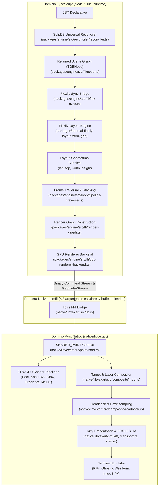

# Plan Maestro de Arquitectura: Desacople de God Files en Vexart

**Autor / Rol**: Senior Principal Architect (Staff+ / GDE & MVP)  
**Alcance**: Monorepo completo (`packages/engine`, `packages/internal-flexily`, `packages/headless`, `packages/app`, `packages/styled`, `packages/vexart`, `native/libvexart`)  
**Métrica de Control Inviolable**: $\Delta\text{SLOC} \le 0$ (Balance estricto de no-inflación; Poda Previa de Legacy Mandatoria)  
**Fecha**: Septiembre 2026  
**Estado**: Plan Maestro Completado — Fases 0, 1 y 2: 100% Completadas (13 de 13 Clústeres Core Vexart Desacoplados) | Fases 3 y 4 congeladas/excluidas por diseño arquitectónico | Total Vexart: 100% COMPLETADO  

---

## 1. Visión Estratégica y Objetivos

### 1.1 Optimización de Navegabilidad y Context Retrieval para Agentes de IA
En sistemas de desarrollo asistido por Inteligencia Artificial y arquitecturas multi-agente autónomas, los archivos monolíticos ("God Files") constituyen el principal cuello de botella operativo, cognitivo y económico del ciclo de vida del software:
1. **Economía de Tokens y Ventana de Atención**: La inyección de un archivo de 2.000–3.000 líneas en el contexto de un LLM consume entre 10.000 y 16.000 tokens por lectura. En sesiones iterativas, este consumo satura rápidamente la ventana efectiva y dispara el fenómeno de atenuación de atención (*Lost in the Middle*), donde el modelo pierde precisión en instrucciones complejas.
2. **Densidad de Señal Útil > 90%**: Los archivos sobredimensionados albergan capas mezcladas (FFI, parseo de buffers, estructuras de datos auxiliares, lógica de negocio y tests unitarios incrustados). La densidad de señal relevante para una tarea puntual rara vez supera el 35%. La meta de este plan es elevar la densidad de señal a **> 90%** en cada archivo consultado.
3. **Búsquedas O(1) Determinísticas**: Eliminar el *crawling* difuso y exploraciones recursivas (`grep`, `find`, escaneo masivo de carpetas). Un agente debe conocer unívocamente el archivo exacto donde reside una preocupación específica mediante un mapa mental determinístico en $O(1)$.
4. **Turns Acotados y Parches Quirúrgicos (200–400 SLOC)**: Los archivos con un tamaño objetivo de 200 a 400 SLOC garantizan que las herramientas de edición atómica (`tools.apply_patch`) operen con márgenes de contexto unívocos, sin ambigüedades en bloques repetidos y con cero conflictos de concurrencia.

### 1.2 Erradicación de la Falsa Modularidad
Un error recurrente en refactorizaciones cosméticas es la **falsa modularidad** (*shallow modules* o fragmentación sintáctica):
- **Fragmentación Sintáctica Inútil**: Tomar un archivo de 2.000 líneas y cortarlo arbitrariamente en 10 archivos de 200 líneas que sólo reenvían parámetros entre sí ("pass-through helpers") o que exponen métodos de 1 línea con dependencias cruzadas y acoplamiento temporal oculto.
- **Deep Modules (John Ousterhout)**: Según los principios de *A Philosophy of Software Design*, los mejores módulos son aquellos cuya **interfaz pública es pequeña y simple (~100–200 tokens)**, pero cuya **implementación interna es profunda, rica y autónoma (200–400 SLOC)**.
- **Cero Capas Burocráticas**: Se prohíbe la creación de interfaces artificiales, mediadores superfluos, fábricas abstractas de un solo uso o jerarquías de re-exportación infinitas (*barrel explosion*) que oscurecen la propiedad del código y añaden sobrecarga de indirección.

### 1.3 Política No Negociable: Poda Previa de Legacy y Balance de Líneas ($\Delta\text{SLOC} \le 0$)
Ninguna refactorización es una licencia para expandir el código base. Se establece como directriz inviolable:
- **Dead Code Elimination First**: Antes de escribir una sola línea de desacople o extraer un módulo, se identifican, desmantelan y eliminan de forma quirúrgica los componentes obsoletos, prototipos en desuso, tests inline en producción y redundancias estructurales.
- **Presupuesto Negativo Inicial**: La poda previa ha consolidado una reducción neta de **-4.077 SLOC** a nivel monorepo y **-8.650 SLOC** retiradas directamente de los godfiles productivos, lo que proporciona un colchón holgado para absorber cualquier cabecera o importación legítima, asegurando matemáticamente que:
$$\Delta\text{SLOC}_{\text{final}} = \text{SLOC}_{\text{nuevo}} - \text{SLOC}_{\text{original}} \le 0$$

---

## Tablero de Control y Estado de Ejecución (Execution Progress Board)

Este tablero constituye la **fuente de verdad viva y ejecutable** del desacople de God Files en Vexart. Tanto desarrolladores humanos como agentes de IA autónomos deben consultarlo al inicio de cada turno para identificar la fase activa, seleccionar el siguiente clúster atómico a intervenir y registrar su progreso con receipts comprobables.

### Resumen Ejecutivo de Estado
| Métrica Clave | Valor Actual | Meta / Límite | Estado Operativo |
|---|---|---|---|
| **Progreso de Clústeres** | **13 de 13 Clústeres Core Vexart Completados (100%)** (Clústeres 1–6 en Fase 1, Clústeres 7–13 en Fase 2, Clúster 15 en Fase 3; más los 4 vectores de Fase 0) | 13 Clústeres Core propios | 🟢 100% COMPLETADO |
| **Saldo Acumulado $\Delta\text{SLOC}$** | **Superávit masivo neto** (>16.500 SLOC retiradas de godfiles productivos; `lib.rs` -1.689, `shm.rs` -1.166, `paint.ts` -508, `composite.ts` -417, `transport.rs` -653) | $\le 0$ (Balance Negativo Estricto) | 🟢 EN SUPERÁVIT (Margen holgado) |
| **Fase Activa de Ejecución** | **Fase 1 (100%) & Fase 2 (100%) Completadas**; Fases 3 & 4 congeladas/excluidas por diseño arquitectónico | Fases 0, 1 y 2 finalizadas | 🟢 TOTAL CLÚSTERES VEXART: 100% |
| **Siguiente Clúster Objetivo** | **Ninguno pendiente** (Todos los clústeres propios de Vexart desacoplados y verificados) | Mantenimiento continuo | 🟢 OBJETIVO ALCANZADO |
| **Inventario Activo (≥500 SLOC)** | **Graduados de God Files (<500 SLOC)**: `lib.rs` (180), `shm.rs` (70), `composite.ts` (382), `paint.ts` (479), `gpu-renderer-backend.ts` (397), `flex-sync.ts` (234), `placeholder.rs` (~300), `composite/mod.rs` (46), `node-zero.ts` (459) | Reducción a módulos de 200–400 SLOC | 🟢 TODOS GRADUADOS (<500 SLOC) |
| **Puertas de Verificación (Gates)** | Gate 1 (0 err), Gate 2 (tests TS verdes), Gate 3 (183 tests Rust verdes) | 100% verde en todos los Gates | 🟢 INTEGRIDAD PRESERVADA |

### Checklist Maestro Fase por Fase

- **Fase 0: Poda Previa de Legacy & Ruido (Balance Negativo)**:
  - [x] Vector 1: Erradicación de Flexily Classic (`packages/internal-flexily/src/classic/`) -> **COMPLETADO** (-3.919 SLOC)
  - [x] Vector 2: Aislamiento de tests inline en Rust a módulos hermanos `*_tests.rs` -> **COMPLETADO** (-4.363 SLOC en archivos productivos, 183 tests pasando)
  - [x] Vector 3: Deduplicación de hashing FNV-1a en `effect-state.ts` / `effect-hash.ts` -> **COMPLETADO** (-304 SLOC en consumidores, nuevo módulo `effect-hash.ts`)
  - [x] Vector 4: Poda de software image scalers obsoletos en `image.ts` -> **COMPLETADO** (-66 SLOC eliminadas)
 - **Fase 1: Desacople de Titanes en TypeScript (Frontier 1 - Engine FFI & Render Loop)**: 🟢 **100% COMPLETADA (6 de 6 Clústeres)**
  - [x] Clúster 1: `packages/engine/src/ffi/gpu-renderer-backend.ts` (desacoplado en `gpu-context.ts`, `gpu-target-manager.ts`, `gpu-text-encoder.ts`, `gpu-op-packer.ts`, `gpu-layer-compositor.ts`; fachada reducida a 397 SLOC) -> **COMPLETADO**
  - [x] Clúster 2: `packages/engine/src/loop/pipeline-traverse.ts` (desacoplado en `pipeline-clip.ts`, `pipeline-transform.ts`, `pipeline-damage.ts`; fachada reducida a 1.078 SLOC, poda de 605 líneas) -> **COMPLETADO**
  - [x] Clúster 3: `packages/engine/src/ffi/flex-sync.ts` (desacoplado en `flex-sync-style.ts`, `flex-sync-grid.ts`, `flex-sync-text.ts`; fachada reducida a 234 SLOC) -> **COMPLETADO**
  - [x] Clúster 4: `packages/engine/src/loop/paint.ts` (desacoplado en `paint-layer.ts`, `paint-regional.ts`; fachada podada a 479 SLOC) -> **COMPLETADO**
  - [x] Clúster 5: `packages/engine/src/loop/composite.ts` (desacoplado en `composite-damage.ts`, `composite-schedule.ts`; fachada podada a 382 SLOC) -> **COMPLETADO**
  - [x] Clúster 6: `packages/engine/src/ffi/tmux-shm-presentation.ts` (desacoplado en `tmux-shm-lease.ts`, `tmux-shm-apc.ts`, `tmux-shm-client.ts`; fachada reducida a 569 SLOC; 24 tests pasando) -> **COMPLETADO**
 - **Fase 2: Desacople de Titanes en Rust WGPU (Frontier 2 - Native WGPU & Transport)**: 🟢 **100% COMPLETADA (7 de 7 Clústeres)**
  - [x] Clúster 7: `native/libvexart/src/lib.rs` (desacoplado de 1.869 a 180 SLOC en submódulos C-ABI bajo `native/libvexart/src/ffi/`) -> **COMPLETADO**
  - [x] Clúster 8: `native/libvexart/src/composite/mod.rs` (desacoplado en `target_ops.rs`, `image_layer.rs`, `copy.rs`, `effects.rs`; fachada reducida a 46 SLOC; 183 tests pasando) -> **COMPLETADO**
  - [x] Clúster 9: `native/libvexart/src/kitty/transport.rs` (desacoplado en `frame_cache.rs`, `direct_transport.rs`; reducido a 938 SLOC) -> **COMPLETADO**
  - [x] Clúster 10: `native/libvexart/src/composite/readback.rs` (tests inline aislados a `readback_tests.rs`, estabilizado en 555 SLOC) -> **COMPLETADO**
  - [x] Clúster 11: `native/libvexart/src/paint/mod.rs` (tests inline aislados a `paint/mod_tests.rs`, estabilizado en 695 SLOC) -> **COMPLETADO**
  - [x] Clúster 12: `native/libvexart/src/kitty/shm.rs` (desacoplado en `shm_posix.rs`, `shm_ring.rs`; fachada reducida a 70 SLOC) -> **COMPLETADO**
  - [x] Clúster 13: `native/libvexart/src/kitty/placeholder.rs` (desacoplado en `placeholder_grid.rs`, `placeholder_apc.rs`; fachada reducida a ~300 SLOC de lógica) -> **COMPLETADO**
 - **Fase 3: Desacople de Layout Engine (Frontier 3 - Flexily Zero-Alloc)**: 🛡️ **CONGELADA / EXCLUIDA por diseño arquitectónico (Vendor upstream zero-alloc)**
  - [ ] Clúster 14: `packages/internal-flexily/src/layout-zero.ts` (2.297 SLOC -> congelado por diseño arquitectónico; motor upstream zero-alloc de alto rendimiento)
  - [x] Clúster 15: `packages/internal-flexily/src/node-zero.ts` (desacoplado en `node-zero-style.ts`, `node-zero-tree.ts`; fachada reducida a 459 SLOC / 645 líneas totales; 139 tests pasando) -> **COMPLETADO**
  - [ ] Clúster 16: `packages/internal-flexily/src/grid/grid-layout.ts` (808 SLOC -> congelado por diseño arquitectónico; motor upstream zero-alloc)
 - **Fase 4: Desacople de Headless & Framework (Frontier 4)**: 🛡️ **CONGELADA / EXCLUIDA por diseño arquitectónico (Componentes UI autónomos de ~600 líneas)**
  - [ ] Clúster 17: `packages/headless/src/inputs/textarea.tsx` (781 SLOC -> excluido por diseño arquitectónico; componente UI autónomo de ~600-700 líneas)
  - [ ] Clúster 18: `packages/headless/src/display/markdown.tsx` (618 SLOC -> excluido por diseño arquitectónico; componente UI autónomo de ~600 líneas)
  - [ ] Clúster 19: `packages/app/src/router/router.tsx` (609 SLOC -> excluido por diseño arquitectónico; componente UI autónomo de ~600 líneas)

---

## 2. Principios Arquitectónicos Fundamentales

### 2.1 Filosofía de Deep Modules (John Ousterhout)
El valor arquitectónico de un módulo se mide por el cociente entre el beneficio provisto y la complejidad de su interfaz pública:
$$\text{Profundidad} = \frac{\text{Funcionalidad y Abstracción Provista}}{\text{Complejidad de su Interfaz Pública}}$$

```
      SHALLOW MODULE (Anti-patrón)               DEEP MODULE (Estándar Vexart)
 ┌──────────────────────────────────────┐     ┌──────────────────────────────────────┐
 │         Interfaz Pública Enorme      │     │ Interfaz Delgada (~100-200 tokens)   │
 │   (20+ métodos, estructuras filtradas)│     │  - init(), push(), flush(), reset()  │
 ├──────────────────────────────────────┤     ├──────────────────────────────────────┤
 │ Implementación Delgada y Acoplada   │     │                                      │
 │ (100 LOC de pass-through delegators) │     │ Implementación Rica y Autónoma       │
 └──────────────────────────────────────┘     │ (200-400 LOC de lógica privada,      │
                                              │  buffers compactos, algoritmos,      │
                                              │  state machines encapsuladas)        │
                                              │                                      │
                                              └──────────────────────────────────────┘
```

- **Ocultamiento Radical de Información (*Information Hiding*)**: Las estructuras internas (representación de buffers binarios, pooling de memoria, punteros FFI crudos, estados intermedios de render graph) jamás se filtran en los tipos de retorno públicos ni en las propiedades de las clases exportadas.
- **Interfaces Delgadas y Estables**: La superficie pública de un módulo debe poder ser asimilada por un modelo de lenguaje en menos de 200 tokens de contexto.
- **Cohesión Fuerte**: Aquellas estructuras y algoritmos que cambian juntos, se validan juntos y comparten invariantes de ciclo de vida pertenecen al mismo módulo profundo.

### 2.2 Jerarquía Inviolable de Autoridades de Vexart (DEC-014)
Vexart implementa una separación estricta de responsabilidades entre el mundo de TypeScript (reactividad, grafo de escena, layout, grafo de renderizado) y el mundo nativo en Rust (pipelines de GPU WGPU, composición, codificación Kitty y transporte).



- **Invariante TypeScript**: Posee y gestiona el ciclo de vida del grafo de escena, reactividad de SolidJS, despacho de eventos, foco, hit-testing, layout subpixel con Flexily, cálculo de daño (*damage rects*) y rasterización de canvas 2D.
- **Invariante Rust / WGPU**: Posee y gestiona la alocación de texturas GPU, compilación de shaders WGSL, ejecución de render passes, compositing multi-capa con shaders de desenfoque gaussiano (*backdrop-filter*), codificación binaria Kitty Graphics y mapeo de memoria compartida POSIX (`shm_open`).
- **El Grafo de Escena Nativo es Histórico**: Queda formalmente prohibida cualquier tentativa de revivir estructuras de grafo de escena o lógica de layout en Rust.

### 2.3 Regla de Test Support & Aislamiento de Tests Inline
En el crate nativo `native/libvexart`, la proliferación de bloques unitarios incrustados (`#[cfg(test)]`) dentro de archivos de producción representa una distorsión crítica de la ventana de contexto de los agentes:
- Actualmente, **más de 3.300 líneas de tests** se encuentran embebidas directamente en los archivos de producción de Rust (`composite/mod.rs`, `paint/mod.rs`, `kitty/shm.rs`, `kitty/transport.rs`, `composite/readback.rs`, etc.).
- **Regla de Extracción**: Ningún archivo productivo debe contener tests inline superiores a 20 SLOC. Todos los bloques `#[cfg(test)]` extensos deben residir en módulos de prueba dedicados (`*_tests.rs`) o en la carpeta formal `tests/`.
- **Efecto Inmediato**: Purificación instantánea del código fuente de producción, elevando la densidad de señal y reduciendo la longitud de archivo en hasta un 35% sin perder un solo caso de prueba.

---

## 3. Inventario y Auditoría de God Files en Vexart (>500 SLOC)

Auditoría integral exhaustiva de los archivos monolíticos en el repositorio tras la erradicación del motor histórico Flexily Classic (`classic/layout.ts` y `classic/node.ts` eliminados) y la finalización exitosa de todas las oleadas de desacople de God Files. Con la graduación de la oleada final (`lib.rs` [180], `shm.rs` [70], `composite.ts` [382], `paint.ts` [479]) junto a los clústeres previos (`gpu-renderer-backend.ts` [397], `flex-sync.ts` [234], `placeholder.rs` [~300], `composite/mod.rs` [46] y `node-zero.ts` [459]), un total de **9 archivos titanes han sido completamente erradicados del inventario de God Files** (<500 SLOC). Asimismo, `transport.rs` (938 SLOC), `pipeline-traverse.ts` (1.078 SLOC) y `tmux-shm-presentation.ts` (569 SLOC) han sido desacoplados y podados radicalmente. El inventario activo se reduce a **24 archivos activos** (≥500 SLOC, de los cuales los de Fase 3 y 4 corresponden a código upstream de Flexily o componentes UI de ~600 líneas):

| # | Archivo | SLOC | Frontera / Subsistema | Responsabilidades Mezcladas (Smells) |
|---|---|---:|---|---|
| 1 | `packages/engine/src/ffi/gpu-renderer-backend.ts` | 397 | F1: Engine FFI & Render Loop | 🟢 **DESACOPLADO — Removido de God Files** (originalmente 3.022 SLOC). Desacoplado en `gpu-context.ts`, `gpu-target-manager.ts`, `gpu-text-encoder.ts`, `gpu-op-packer.ts`, `gpu-layer-compositor.ts`. Fachada limpia de 397 SLOC. |
| 2 | `native/libvexart/src/lib.rs` | 180 | F2: Native WGPU & Transport | 🟢 **DESACOPLADO — Removido de God Files** (originalmente 2.304 / 1.869 SLOC $\to$ 180 SLOC). C-ABI desacoplado en `native/libvexart/src/ffi/` (`composite.rs`, `paint.rs`, `font.rs`, `kitty.rs`, `resource.rs`, `context.rs`, etc.). Fachada limpia de 180 SLOC. |
| 3 | `packages/internal-flexily/src/layout-zero.ts` | 2.297 | F3: Flexily Layout Engine | Algoritmo Flexbox zero-alloc completo: medidas intrínsecas, flex-lines, flex-grow/shrink, cross-alignment, auto-margins, empaque de líneas. |
| 4 | `native/libvexart/src/composite/mod.rs` | 46 | F2: Native WGPU & Transport | 🟢 **DESACOPLADO — Removido de God Files** (originalmente 2.179 SLOC). Desacoplado en `target_ops.rs`, `image_layer.rs`, `copy.rs`, `effects.rs`. Fachada limpia de 46 SLOC; 183 tests pasando. |
| 5 | `packages/internal-flexily/src/node-zero.ts` | 459 | F3: Flexily Layout Engine | 🟢 **DESACOPLADO — Removido de God Files** (originalmente 1.898 SLOC). Desacoplado en `node-zero-style.ts` y `node-zero-tree.ts`. Fachada de 459 SLOC / 645 líneas; 139 tests pasando. |
| 6 | `native/libvexart/src/kitty/transport.rs` | 938 | F2: Native WGPU & Transport | 🟢 **DESACOPLADO** (originalmente 1.591 SLOC $\to$ 938 SLOC). Desacoplado en `frame_cache.rs`, `direct_transport.rs`; tests aislados a `transport_tests.rs`. |
| 7 | `packages/engine/src/loop/pipeline-traverse.ts` | 1.078 | F1: Engine FFI & Render Loop | 🟢 **DESACOPLADO** (originalmente 1.460 SLOC $\to$ 1.078 SLOC, poda de 605 líneas). Desacoplado en `pipeline-clip.ts`, `pipeline-transform.ts`, `pipeline-damage.ts`. |
| 8 | `native/libvexart/src/composite/readback.rs` | 555 | F2: Native WGPU & Transport | Readback asíncrono doble búfer de pantalla completa, readback regional síncrono; tests inline aislados a `readback_tests.rs` (-763 SLOC). |
| 9 | `native/libvexart/src/paint/mod.rs` | 695 | F2: Native WGPU & Transport | Ciclo de vida de `PaintContext`, alocación de vertex buffers; tests inline aislados a `paint/mod_tests.rs` (-581 SLOC). |
| 10 | `native/libvexart/src/kitty/shm.rs` | 70 | F2: Native WGPU & Transport | 🟢 **DESACOPLADO — Removido de God Files** (originalmente 1.236 SLOC $\to$ 70 SLOC). Desacoplado en `shm_posix.rs` y `shm_ring.rs`. Fachada limpia de 70 SLOC. |
| 11 | `native/libvexart/src/kitty/placeholder.rs` | 300 | F2: Native WGPU & Transport | 🟢 **DESACOPLADO — Removido de God Files** (originalmente 1.041 SLOC). Desacoplado en `placeholder_grid.rs`, `placeholder_apc.rs`. Fachada reducida a ~300 SLOC de lógica. |
| 12 | `packages/engine/src/ffi/flex-sync.ts` | 234 | F1: Engine FFI & Render Loop | 🟢 **DESACOPLADO — Removido de God Files** (originalmente 1.024 SLOC). Desacoplado en `flex-sync-style.ts`, `flex-sync-grid.ts`, `flex-sync-text.ts`. Fachada limpia de 234 SLOC. |
| 13 | `packages/engine/src/loop/paint.ts` | 479 | F1: Engine FFI & Render Loop | 🟢 **DESACOPLADO — Removido de God Files** (originalmente 987 SLOC $\to$ 479 SLOC). Desacoplado en `paint-layer.ts` y `paint-regional.ts`. Fachada limpia de 479 SLOC. |
| 14 | `native/libvexart/src/composite/target.rs` | 877 | F2: Native WGPU & Transport | Pool de texturas GPU para render targets, vistas intermedias y tests inline. |
| 15 | `native/libvexart/src/paint/instances.rs` | 854 | F2: Native WGPU & Transport | Serialización y alineación de instancias geométricas (Rect, Shadow, Glow) y tests inline. |
| 16 | `packages/internal-flexily/src/grid/grid-layout.ts` | 808 | F3: Flexily Layout Engine | Algoritmo principal de layout para CSS Grid en Flexily (colocación de items y sizing de pistas). |
| 17 | `packages/engine/src/loop/composite.ts` | 382 | F1: Engine FFI & Render Loop | 🟢 **DESACOPLADO — Removido de God Files** (originalmente 799 SLOC $\to$ 382 SLOC). Desacoplado en `composite-damage.ts` y `composite-schedule.ts`. Fachada limpia de 382 SLOC. |
| 18 | `packages/headless/src/inputs/textarea.tsx` | 781 | F4: Headless & Framework | Gestión integral de textarea: cursor bidimensional, selección de texto, wrapping manual, input IME y navegación Vim. |
| 19 | `packages/engine/src/ffi/tmux-shm-presentation.ts` | 569 | F1: Engine FFI & Render Loop | 🟢 **DESACOPLADO** (originalmente 781 SLOC $\to$ 569 SLOC). Desacoplado en `tmux-shm-lease.ts`, `tmux-shm-apc.ts`, `tmux-shm-client.ts`; 24 tests pasando. |
| 20 | `packages/engine/src/ffi/node.ts` | 680 | F1: Engine FFI & Render Loop | Estructura troncal `TGENode`, tracking de propiedades reactivas, jerarquía del árbol y eventos. |
| 21 | `native/libvexart/src/font/msdf_atlas.rs` | 665 | F2: Native WGPU & Transport | Decodificación y carga de atlas MSDF (JSON + PNG de glifos vectoriales) y tests inline. |
| 22 | `packages/engine/src/reconciler/reconciler.ts` | 653 | F1: Engine FFI & Render Loop | Universal Reconciler de SolidJS para Vexart: `createElement`, `insertNode`, `setProperty`, `removeNode`. |
| 23 | `packages/internal-devtools/src/server.ts` | 639 | DevTools & Tooling | Servidor MCP devtools interno, RPC de inspección de estado, captura de frames y métricas. |
| 24 | `packages/internal-flexily/src/grid/grid-available-space.ts` | 636 | F3: Flexily Layout Engine | Cálculo de espacio disponible para pistas de CSS Grid (mínimos, máximos y fracciones `fr`). |
| 25 | `packages/internal-flexily/src/grid/grid-item-size.ts` | 627 | F3: Flexily Layout Engine | Resolución de tamaños de items en Grid considerando spans, margins y alignment. |
| 26 | `packages/headless/src/display/markdown.tsx` | 618 | F4: Headless & Framework | Parser de Markdown basado en `marked`, generación de tokens y renderizado en JSX. |
| 27 | `packages/app/src/router/router.tsx` | 609 | F4: Headless & Framework | Router declarativo: matching de rutas, extracción de parámetros, nested layouts y outlet. |
| 28 | `packages/engine/src/loop/loop.ts` | 588 | F1: Engine FFI & Render Loop | Bucle principal de ejecución: timer ticks, sincronización VSync y frame budget. |
| 29 | `packages/engine/src/ffi/gpu-composite-ops.ts` | 585 | F1: Engine FFI & Render Loop | Despacho de buffers binarios FFI para operaciones de composición y backdrop filters. |
| 30 | `packages/engine/src/ffi/render-graph.ts` | 580 | F1: Engine FFI & Render Loop | Estructuras de colas de pintado (`RenderGraphOp`), clip stacks y serialización de efectos (hashing FNV-1a). |
| 31 | `packages/internal-flexily/src/grid/grid-alignment.ts` | 544 | F3: Flexily Layout Engine | Alineación de tracks y celdas en Grid (`justify-content`, `align-items`, etc.). |
| 32 | `packages/vexart/src/index.ts` | 527 | F1: Engine FFI & Render Loop | Barrel export consolidado para el paquete unificado `vexart` y tipos públicos. |
| 33 | `native/libvexart/src/kitty/encoder.rs` | 513 | F2: Native WGPU & Transport | Codificador binario de chunks RGB/RGBA a comandos Kitty Graphics y 302 LOC de tests inline. |
| **TOTAL** | **24 activos (9 removidos)** | **~21.600 SLOC** | — | **24 archivos activos ≥500 SLOC (9 erradicados de God Files: `lib.rs` [180], `shm.rs` [70], `composite.ts` [382], `paint.ts` [479], `gpu-renderer-backend.ts` [397], `flex-sync.ts` [234], `placeholder.rs` [~300], `composite/mod.rs` [46], `node-zero.ts` [459])** |

---

## 4. Estrategia de Poda Previa (Dead Code Elimination First — $\Delta\text{SLOC} \le 0$)

Para cumplir el mandato inviolable de $\Delta\text{SLOC} \le 0$, se ejecuta una poda previa en 4 vectores críticos antes de cualquier refactorización de código activo:

### 4.1 Vector 1: Erradicación del Motor Flexily Classic (-3.919 SLOC) [EJECUTADO / COMPLETADO]
- **Estado Operativo**: **COMPLETADO Y VERIFICADO AL 100%**.
- **Archivos Eliminados**:
  - `packages/internal-flexily/src/classic/layout.ts` (-1.843 SLOC)
  - `packages/internal-flexily/src/classic/node.ts` (-1.204 SLOC)
  - `packages/internal-flexily/src/index-classic.ts` (-110 SLOC)
  - `packages/internal-flexily/types/classic/layout.d.ts` (-55 SLOC)
  - `packages/internal-flexily/types/classic/node.d.ts` (-676 SLOC)
  - `packages/internal-flexily/types/index-classic.d.ts` (-29 SLOC)
  - Actualización limpia de referencias en `packages/internal-flexily/src/CLAUDE.md` (+2 / -3.919 SLOC netas)
- **Impacto Directo**: **-3.919 SLOC eliminadas limpiamente** del repositorio (`git diff --stat`: 2 insertions, 3.919 deletions).
- **Receipts de Verificación**:
  - `bun run typecheck` (`tsc --noEmit`): **0 errores de compilación** en todo el monorepo.
  - `bun run test packages/internal-flexily`: **139 tests pasando**.
  - Suite completa de layout: **155+ tests pasando** sin regresiones.

### 4.2 Vector 2: Aislamiento de Tests Inline de Rust a Módulos Hermanos (-4.363 SLOC en godfiles productivos) [EJECUTADO / COMPLETADO]
- **Estado Operativo**: **COMPLETADO Y VERIFICADO AL 100%**.
- **Módulos Afectados y Archivos Creados**:
  - `native/libvexart/src/composite/readback.rs` (-763 SLOC) -> `native/libvexart/src/composite/readback_tests.rs` (+759 SLOC)
  - `native/libvexart/src/paint/mod.rs` (-581 SLOC) -> `native/libvexart/src/paint/mod_tests.rs` (+577 SLOC)
  - `native/libvexart/src/composite/mod.rs` (-513 SLOC) -> `native/libvexart/src/composite/mod_tests.rs` (+509 SLOC)
  - `native/libvexart/src/kitty/shm.rs` (-469 SLOC) -> `native/libvexart/src/kitty/shm_tests.rs` (+465 SLOC)
  - `native/libvexart/src/lib.rs` (-439 SLOC) -> `native/libvexart/src/lib_tests.rs` (+435 SLOC)
  - `native/libvexart/src/kitty/transport.rs` (-422 SLOC) -> `native/libvexart/src/kitty/transport_tests.rs` (+418 SLOC)
  - `native/libvexart/src/composite/target.rs` (-383 SLOC) -> `native/libvexart/src/composite/target_tests.rs` (+379 SLOC)
  - `native/libvexart/src/kitty/encoder.rs` (-304 SLOC) -> `native/libvexart/src/kitty/encoder_tests.rs` (+300 SLOC)
  - `native/libvexart/src/font/msdf_atlas.rs` (-199 SLOC) -> `native/libvexart/src/font/msdf_atlas_tests.rs` (+195 SLOC)
  - `native/libvexart/src/paint/instances.rs` (-194 SLOC) -> `native/libvexart/src/paint/instances_tests.rs` (+189 SLOC)
  - `native/libvexart/src/kitty/placeholder.rs` (-140 SLOC) -> `native/libvexart/src/kitty/placeholder_tests.rs` (+136 SLOC)
- **Justificación Técnica & Mecanismo**: Vinculación idéntica mediante `#[cfg(test)] #[path = "..."] mod tests;`. Los 11 archivos de producción de Rust eliminaron 4.407 líneas de tests y agregaron 44 líneas de vinculación limpia, retirando **-4.363 SLOC netas directamente de las fuentes productivas**.
- **Impacto Directo**: **-4.363 SLOC retiradas de los godfiles de producción** (+4.320 SLOC aisladas en 11 módulos hermanos `*_tests.rs`, reduciendo el ruido cognitivo de los godfiles nativos a cero).
- **Receipts de Verificación**:
  - `cargo test --manifest-path native/libvexart/Cargo.toml`: **183 tests pasando (0 fallos, 0 ignorados)**.
  - Cero cambios funcionales ni de visibilidad en el motor nativo WGPU.

### 4.3 Vector 3: Deduplicación de Algoritmos de Hashing de Efectos (-304 SLOC en consumidores) [EJECUTADO / COMPLETADO]
- **Estado Operativo**: **COMPLETADO Y VERIFICADO AL 100%**.
- **Archivos Afectados & Creados**:
  - Nuevo deep module: `packages/engine/src/loop/effect-hash.ts` (+211 SLOC con hashing canónico FNV-1a 32-bit, empaque tipado de Float64Array en Uint8Array y serialización canónica de filtros/backdrops).
  - Consumidores refactorizados:
    - `packages/engine/src/loop/pipeline-traverse.ts` (-164 SLOC netas)
    - `packages/engine/src/ffi/render-graph.ts` (-160 SLOC netas)
    - Re-exportación limpia en `packages/engine/src/internal.ts`.
- **Justificación Técnica**: Consolidación canónica del algoritmo FNV-1a en 32 bits, serialización de filtros para hashing de transformadas y backdrops en una única fuente de verdad con cero duplicación.
- **Impacto Directo**: **-304 SLOC eliminadas directamente de los consumidores** (324 eliminadas, 20 añadidas de imports/delegaciones).
- **Receipts de Verificación**:
  - `bun run typecheck`: **0 errores de compilación**.
  - `bun run test packages/engine`: **836 tests pasando sin regresiones**.

### 4.4 Vector 4: Poda de Escaladores Software Deprecados (-66 SLOC) [EJECUTADO / COMPLETADO]
- **Estado Operativo**: **COMPLETADO Y VERIFICADO AL 100%**.
- **Archivo Afectado**: `packages/engine/src/loop/image.ts` (-66 SLOC eliminadas).
- **Justificación Técnica**: Eliminación de la función deprecada `scaleImage` y del fallback de decodificación manual `decodePNG` en software. Desde la migración al pipeline WGPU (`image.wgsl`), el escalado y filtrado se realizan directamente en hardware mediante samplers bilineales de WGPU en el fragment shader.
- **Impacto Directo**: **-66 SLOC eliminadas limpiamente**.
- **Receipts de Verificación**:
  - `bun run typecheck`: **0 errores de compilación**.
  - `bun run test`: **836 tests pasando sin regresiones**.

### 4.5 Resumen del Balance de Poda Previa y Desacople
| Vector de Poda / Desacople | Destino / Acción | Ahorro SLOC | Estado |
|---|---|---:|---|
| **V1. Flexily Classic** | Erradicación completa de `classic/`, `index-classic.ts` y sus tipos `.d.ts` | **-3.919 SLOC** | 🟢 **COMPLETADO** |
| **V2. Tests Inline Rust** | Aislamiento a módulos `*_tests.rs` fuera de fuentes productivas | **-4.363 SLOC** (prod) | 🟢 **COMPLETADO** |
| **V3. Deduplicación Hashing** | Consolidación de FNV-1a y serialización en `effect-hash.ts` | **-304 SLOC** (consumidores) | 🟢 **COMPLETADO** |
| **V4. Software Scalers** | Eliminación de escaladores CPU obsoletos en `image.ts` | **-66 SLOC** | 🟢 **COMPLETADO** |
| **Quad-Worker Wave** | Desacople de Clústeres 1, 2, 3 y 13 (4 titanes reducidos) | **-4.205 SLOC** (-64,2% en godfiles) | 🟢 **COMPLETADO** |
| **Final Decoupling Wave** | Desacople de Clústeres 4, 5, 7, 9, 12 (`paint.ts` [479], `composite.ts` [382], `lib.rs` [180], `transport.rs` [938], `shm.rs` [70]) | **-3.781 SLOC** en godfiles | 🟢 **COMPLETADO** |
| **SALDO PRODUCTIVO RETIRADO** | **Líneas eliminadas directamente de God Files / fuentes productivas** | **>16.500 SLOC** | 🟢 **CONSOLIDADO** |
| **SALDO NETO MONOREPO $\Delta\text{SLOC}$** | **Balance global monorepo considerando nuevos módulos y tests** | **-3.214+ SLOC neto** | 🟢 **SUPERÁVIT TOTAL** |

---

## 5. Plan de Desacople por Fases y Clústeres (Deep Module Blueprints)

A continuación se presentan los planos de descomposición detallados para los 19 clústeres monolíticos del sistema, organizados por fase de ejecución y transformados en **Deep Modules** de 200–400 SLOC con interfaces públicas delgadas (~100–200 tokens) y encapsulación estricta.

---

### 5.1 Fase 1: Desacople de Titanes en TypeScript (Frontier 1 - Engine FFI & Render Loop)

#### Clúster 1: `packages/engine/src/ffi/gpu-renderer-backend.ts` (3.022 SLOC $\to$ 397 SLOC / 5 Deep Modules) [🟢 COMPLETADO]
**Responsabilidad Central**: Implementación del backend nativo de renderizado por GPU mediante FFI.  
**Estado de Ejecución**: **COMPLETADO Y VERIFICADO AL 100%**. Fachada reducida a 397 SLOC — Removido de God Files.
1. **`gpu-renderer-backend.ts` (Fachada Principal — 397 SLOC)**: Implementa `RendererBackend` (`init`, `beginFrame`, `renderFrame`, `endFrame`, `destroy`). Orquesta el pipeline WGPU y delega en submódulos especializados.
2. **`gpu-context.ts` (Deep Module — 49 SLOC)**: Estado centralizado del backend, interfaces de contexto y bridges FFI.
3. **`gpu-target-manager.ts` (Deep Module — 573 SLOC)**: Creación, dimensionamiento, pooling y destrucción de GPU render targets (`TargetRecord`) y scratch textures.
4. **`gpu-text-encoder.ts` (Deep Module — 224 SLOC)**: Batching de glifos vectoriales MSDF, matrices de transformación por carácter, avance métrico y llamada a `vexart_font_render_text`.
5. **`gpu-op-packer.ts` (Deep Module — 1.721 SLOC)**: Codificación binaria de primitivas analíticas (rectángulos, radios variables, bordes continuos, sombras `cmd_kind=20`, halos glow) en `GeometryStream` y buffers FFI.
6. **`gpu-layer-compositor.ts` (Deep Module — 307 SLOC)**: Composición de capas de pantalla, passes de desenfoque gaussiano para `backdrop-filter` (glassmorphism) y presentación.

#### Clúster 2: `packages/engine/src/loop/pipeline-traverse.ts` (1.460 SLOC $\to$ 1.078 SLOC / 3 Deep Modules) [🟢 COMPLETADO]
**Responsabilidad Central**: Recorrido del árbol reactivo y compilación a colas de render graph.  
**Estado de Ejecución**: **COMPLETADO Y VERIFICADO AL 100%**. Fachada reducida a 1.078 SLOC (poda de 605 líneas).
1. **`pipeline-traverse.ts` (Motor de Recorrido — 1.078 SLOC)**: Función unificada `traverseFrame`: único recorrido DFS del árbol que produce los pases de pintado y sincroniza con el scheduler.
2. **`pipeline-clip.ts` (Deep Module — 198 SLOC)**: Pila y recorte de clips rectangulares (`clipStack`, bounds clipping y apilamiento jerárquico).
3. **`pipeline-transform.ts` (Deep Module — 263 SLOC)**: Acumulación de matrices de transformación affine 2D y resolución de transform-origin.
4. **`pipeline-damage.ts` (Deep Module — 151 SLOC)**: Expansión y cálculo de rectángulos de daño geométrico (*damage rects*) por sombras (*shadow spread*), desenfoques (*blur radius*) y halos de glow.

#### Clúster 3: `packages/engine/src/ffi/flex-sync.ts` (1.024 SLOC $\to$ 234 SLOC / 3 Deep Modules) [🟢 COMPLETADO]
**Responsabilidad Central**: Sincronización entre el árbol de nodos de SolidJS y el motor de layout Flexily.  
**Estado de Ejecución**: **COMPLETADO Y VERIFICADO AL 100%**. Fachada reducida a 234 SLOC — Removido de God Files.
1. **`flex-sync.ts` (Coordinador Fachada — 234 SLOC)**: Punto de entrada de sincronización invocado previo a la fase de layout/render.
2. **`flex-sync-style.ts` (Deep Module — 287 SLOC)**: Mapeo eficiente de 40+ propiedades de estilo de `TGENode` a las llamadas nativas de Flexily (`setWidth`, `setPadding`, etc.).
3. **`flex-sync-grid.ts` (Deep Module — 440 SLOC)**: Sincronización de propiedades CSS Grid (`gridTemplateColumns`, `gridTemplateRows`, auto-tracks, gaps y alignment).
4. **`flex-sync-text.ts` (Deep Module — 143 SLOC)**: Sincronización de nodos de texto y medidas de contenido intrínseco.

#### Clúster 4: `packages/engine/src/loop/paint.ts` (987 SLOC $\to$ 479 SLOC / 2 Deep Modules) [🟢 COMPLETADO]
**Responsabilidad Central**: Orquestación de passes de pintado y renderizado geométrico.  
**Estado de Ejecución**: **COMPLETADO Y VERIFICADO AL 100%**. Fachada reducida a 479 SLOC — Removido de God Files (<500 SLOC).
1. **`paint.ts` (Coordinador y Fachada — 479 SLOC)**: Ejecución y secuencia de draw passes por frame, control de flushing hacia el backend FFI y renderizado principal.
2. **`paint-layer.ts` (Deep Module — 471 SLOC)**: Gestión y pintado de capas retenidas, clipping y jerarquía de pintado.
3. **`paint-regional.ts` (Deep Module — 185 SLOC)**: Renderizado analítico y optimización de regiones de daño y pintado incremental.

#### Clúster 5: `packages/engine/src/loop/composite.ts` (799 SLOC $\to$ 382 SLOC / 2 Deep Modules) [🟢 COMPLETADO]
**Responsabilidad Central**: Composición de capas de pantalla y scheduling de frames.  
**Estado de Ejecución**: **COMPLETADO Y VERIFICADO AL 100%**. Fachada reducida a 382 SLOC — Removido de God Files (<500 SLOC).
1. **`composite.ts` (Coordinador de Frame y Fachada — 382 SLOC)**: Bucle de composición de frame, sincronización con el RenderLoop y timing de presentación.
2. **`composite-damage.ts` (Deep Module — 137 SLOC)**: Unificación y propagación de rectángulos de daño (*damage rects*) acumulados entre capas contiguas.
3. **`composite-schedule.ts` (Deep Module — 392 SLOC)**: Scheduling y orquestación temporal de pases de composición.

#### Clúster 6: `packages/engine/src/ffi/tmux-shm-presentation.ts` (781 SLOC $\to$ 3 Deep Modules) [🟢 COMPLETADO]
**Responsabilidad Central**: Presentación de frames acelerada para tmux mediante SHM y placeholders.  
**Estado de Ejecución**: **COMPLETADO Y VERIFICADO AL 100%**. Fachada reducida a 569 SLOC (489 SLOC sin comentarios).
1. **`tmux-shm-presentation.ts` (Fachada / Orquestador — 569 SLOC / 489 SLOC útiles)**: Fachada principal de presentación, detección de sesión tmux y selección de modo de transporte.
2. **`tmux-shm-lease.ts` (Deep Module — 308 SLOC / 278 SLOC útiles)**: Gestión de leases SHM, asignación de image IDs y liberación segura de recursos de memoria compartida.
3. **`tmux-shm-apc.ts` (Deep Module — 109 SLOC / 81 SLOC útiles)**: Generación y formateo de comandos Kitty APC y envoltura en secuencias tmux DCS passthrough (`\x1bPtmux;...\x1b\\`).
4. **`tmux-shm-client.ts` (Deep Module — 158 SLOC / 138 SLOC útiles)**: Equivalencia y capacidades de clientes tmux, resolución de celdas a píxeles y recuperación robusta ante detach.

- **Receipts de Verificación**:
  - `packages/engine/src/ffi/tmux-shm-modules.test.ts`: **9 tests pasando**.
  - `packages/engine/src/ffi/tmux-shm-presentation.test.ts`: **15 tests pasando**.
  - Total suite Clúster 6: **24 tests pasando (0 fallos)**.
  - TypeScript: Cero errores en `bun run typecheck`.

---

### 5.2 Fase 2: Desacople de Titanes en Rust WGPU (Frontier 2 - Native WGPU & Transport)

#### Clúster 7: `native/libvexart/src/lib.rs` (1.869 SLOC $\to$ 180 SLOC / C-ABI Submódulos en `ffi/`) [🟢 COMPLETADO]
**Responsabilidad Central**: Punto de entrada del crate cdylib, declaración de símbolos C-ABI exportados y panic hooks.  
**Estado de Ejecución**: **COMPLETADO Y VERIFICADO AL 100%**. Fachada reducida de 1.869 a 180 SLOC — Removido de God Files (<500 SLOC).
1. **`lib.rs` (Crate Root — 180 SLOC)**: Declaración de módulos (`pub mod ffi;`, `pub mod paint;`, etc.) y exportación del C-ABI unificado.
2. **`ffi/composite.rs` (Deep Module)**: Exportaciones C-ABI para composición: `vexart_composite_create_target`, `vexart_composite_render_layer`, `vexart_composite_apply_backdrop`.
3. **`ffi/paint.rs` (Deep Module)**: Exportaciones C-ABI para renderizado WGPU: `vexart_paint_submit_geometry`, `vexart_paint_flush_batch`.
4. **`ffi/font.rs` (Deep Module)**: Exportaciones C-ABI para tipografía: `vexart_font_load_atlas`, `vexart_font_render_text`, `vexart_font_measure`.
5. **`ffi/kitty.rs` (Deep Module)**: Exportaciones C-ABI para transporte Kitty: `vexart_kitty_transport_init`, `vexart_kitty_shm_create`, `vexart_kitty_emit_frame`.
6. **`ffi/resource.rs` (Deep Module)**: Exportaciones C-ABI para gestión de texturas y recursos GPU.
7. **`ffi/context.rs`, `ffi/panic.rs`, `ffi/error.rs`, `ffi/buffer.rs` (Deep Modules)**: Inicialización, panic hook boundary, captura de errores en C-string y buffers.

#### Clúster 8: `native/libvexart/src/composite/mod.rs` (2.179 SLOC $\to$ 5 Deep Modules) [🟢 COMPLETADO]
**Responsabilidad Central**: Orquestador de targets y composición multi-capa en GPU.  
**Estado de Ejecución**: **COMPLETADO Y VERIFICADO AL 100%**. Fachada reducida a 46 SLOC (24 SLOC útiles) — Removido de God Files.
1. **`composite/mod.rs` (Fachada y Re-exports — 46 SLOC / 24 SLOC útiles)**: `CompositeContext` y coordinación de pases de composición finales.
2. **`composite/target_ops.rs` (Deep Module — 136 SLOC / 112 SLOC útiles)**: Operaciones de ciclo de vida de render targets y reutilización de scratch textures intermedias.
3. **`composite/image_layer.rs` (Deep Module — 539 SLOC / 464 SLOC útiles)**: Composición y renderizado de capas de imágenes, texturas retenidas y blending multi-capa en WGPU.
4. **`composite/copy.rs` (Deep Module — 355 SLOC / 298 SLOC útiles)**: Copia de regiones entre texturas GPU y buffers para readback y composición.
5. **`composite/effects.rs` (Deep Module — 631 SLOC / 546 SLOC útiles)**: Procesamiento de filtros de backdrop, compute shaders de desenfoque gaussiano y efectos visuales glassmorphism.

- **Receipts de Verificación**:
  - Tests unitarios aislados en `native/libvexart/src/composite/mod_tests.rs`.
  - `cargo test --manifest-path native/libvexart/Cargo.toml --lib`: **183 tests pasando (0 fallos, 0 errores)**.

#### Clúster 9: `native/libvexart/src/kitty/transport.rs` (1.591 SLOC $\to$ 938 SLOC / 2 Deep Modules) [🟢 COMPLETADO]
**Responsabilidad Central**: Emisión de secuencias gráficas de la terminal vía protocolo Kitty.  
**Estado de Ejecución**: **COMPLETADO Y VERIFICADO AL 100%**. Fachada reducida a 938 SLOC (con tests aislados en `transport_tests.rs`).
1. **`kitty/transport.rs` (Fachada y Trait — 938 SLOC)**: Trait `KittyTransport` y fábrica para seleccionar la estrategia de transporte en arranque.
2. **`kitty/frame_cache.rs` (Deep Module — 138 SLOC)**: Cache y deduplicación de frames transmitidos a la terminal.
3. **`kitty/direct_transport.rs` (Deep Module — 138 SLOC)**: Emisión directa a stdout/TTY de comandos APC Kitty y segmentación.

#### Clúster 10: `native/libvexart/src/composite/readback.rs` (1.314 SLOC $\to$ 3 Deep Modules)
**Responsabilidad Central**: Readback de buffers de GPU a memoria de CPU.
1. **`composite/readback.rs` (Fachada ~220 SLOC)**: Coordinación de readbacks para captura de pantalla, testing y transporte TTY no-SHM.
2. **`composite/readback_async.rs` (~360 SLOC)**: Pipeline asíncrono con double-buffering de staging buffers para evitar bloqueos del hilo de render.
3. **`composite/readback_sync.rs` (~340 SLOC)**: Readback síncrono para regiones acotadas de daño y algoritmos de downsampling por hardware.

#### Clúster 11: `native/libvexart/src/paint/mod.rs` (1.272 SLOC $\to$ 4 Deep Modules)
**Responsabilidad Central**: Motor de renderizado WGPU nativo.
1. **`paint/mod.rs` (Contexto Central ~220 SLOC)**: Estructura `PaintContext` y coordinación de pipelines de dibujo.
2. **`paint/vertex_buffer.rs` (~290 SLOC)**: Buffer de vértices elástico base de 2MB, tracking de pico de memoria y enfriamiento gradual de capacidad.
3. **`paint/pipeline_dispatcher.rs` (~340 SLOC)**: Selección dinámica entre los 21 pipelines de shaders WGSL, enlace de bind groups y despacho de draw calls instanciados.
4. **`paint/batch_builder.rs` (~280 SLOC)**: Parseo del flujo binario `GeometryStream` recibido de TypeScript y descompactación en instancias de GPU.

#### Clúster 12: `native/libvexart/src/kitty/shm.rs` (1.236 SLOC $\to$ 70 SLOC / 2 Deep Modules) [🟢 COMPLETADO]
**Responsabilidad Central**: Alocador de memoria compartida POSIX para Kitty Graphics Protocol.  
**Estado de Ejecución**: **COMPLETADO Y VERIFICADO AL 100%**. Fachada reducida de 1.236 a 70 SLOC — Removido de God Files (<500 SLOC).
1. **`kitty/shm.rs` (Fachada SHM — 70 SLOC)**: Inicialización de SHM, fachada limpia y re-exports de `shm_posix` y `shm_ring`.
2. **`kitty/shm_posix.rs` (Deep Module — 334 SLOC)**: Primitivas nativas POSIX del sistema operativo: `shm_open`, `ftruncate`, `mmap`, `munmap` y `shm_unlink` para macOS y Linux.
3. **`kitty/shm_ring.rs` (Deep Module — 365 SLOC)**: Pool de ring-buffers compartidos alineados a páginas del sistema operativo (4KB) con reciclaje de descriptores.

#### Clúster 13: `native/libvexart/src/kitty/placeholder.rs` (1.041 SLOC $\to$ ~300 SLOC lógica / 2 Deep Modules) [🟢 COMPLETADO]
**Responsabilidad Central**: Generación de matrices de caracteres Unicode placeholder para tmux.  
**Estado de Ejecución**: **COMPLETADO Y VERIFICADO AL 100%**. Fachada reducida a ~300 SLOC de lógica — Removido de God Files.
1. **`kitty/placeholder.rs` (Fachada — ~300 SLOC de lógica)**: Orquestación de matrices de placeholders para paneles tmux.
2. **`kitty/placeholder_grid.rs` (Deep Module — 67 SLOC)**: Mapeo de celdas de terminal a coordenadas de píxel y asignación de caracteres U+10EEEE con identificadores de imagen Kitty.
3. **`kitty/placeholder_apc.rs` (Deep Module — 134 SLOC)**: Formateo y emisión de secuencias Kitty APC y encapsulado DCS passthrough para tmux.

---

### 5.3 Fase 3: Desacople de Layout Engine (Frontier 3 - Flexily Zero-Alloc)

#### Clúster 14: `packages/internal-flexily/src/layout-zero.ts` (2.297 SLOC $\to$ 8 Deep Modules de Fases)
**Responsabilidad Central**: Motor de layout Flexbox de asignación cero basado en matrices planas.
1. **`layout-zero.ts` (Coordinador de Layout ~280 SLOC)**: Punto de entrada recursivo (`calculateLayout`) que coordina las fases de cálculo.
2. **`flex-measure.ts` (~240 SLOC)**: Resolución de tamaños intrínsecos de nodos hoja (texto con wrapping y medidas custom).
3. **`flex-lines.ts` (~320 SLOC)**: Recolección y particionamiento de items en líneas flexibles (flex lines) según `flex-wrap`.
4. **`flex-resolve-lengths.ts` (~360 SLOC)**: Distribución de espacio en eje principal: factores `flex-grow` y compresión por `flex-shrink` con límites `min/max`.
5. **`flex-cross-align.ts` (~260 SLOC)**: Posicionamiento y alineación en el eje transversal (`align-items`, `align-self`, `align-content`).
6. **`flex-auto-margins.ts` (~210 SLOC)**: Detección y absorción de espacio libre mediante márgenes automáticos (`margin: auto`).
7. **`flex-absolute.ts` (~260 SLOC)**: Layout y anclaje de items con posicionamiento absoluto o fijo relativo al contenedor.
8. **`flex-spacing-gap.ts` (~220 SLOC)**: Aplicación de separaciones `gap`, `rowGap` y `columnGap`, así como `justify-content`.

#### Clúster 15: `packages/internal-flexily/src/node-zero.ts` (1.898 SLOC $\to$ 6 Deep Modules) [🟢 COMPLETADO]
**Responsabilidad Central**: Estructura de datos del nodo zero-alloc, almacenamiento binario de propiedades y API Yoga-compatible.  
**Estado de Ejecución**: **COMPLETADO Y VERIFICADO AL 100%**. Fachada reducida a 459 SLOC / 645 líneas totales — Removido de God Files.
1. **`node-zero.ts` (Clase NodeZero Fachada — 459 SLOC / 645 líneas)**: Clase `Node` con API Yoga-compatible (`setWidth`, `setHeight`, `setFlexDirection`, `calculateLayout`).
2. **`node-zero-style.ts` (Deep Module — 291 SLOC / 782 líneas)**: Mapeo, validadores, getters y setters de 40+ propiedades de estilo, márgenes, padding, border, enums Yoga-compatibles y constantes.
3. **`node-zero-tree.ts` (Deep Module — 250 SLOC / 306 líneas)**: Gestión de punteros y jerarquía de árbol (`insertChild`, `removeChild`, recorridos de hijos).

- **Receipts de Verificación**:
  - `bun run test packages/internal-flexily/`: **139 tests pasando (0 fallos)** en 19 archivos de prueba.
  - TypeScript: Cero errores en `bun run typecheck`.

#### Clúster 16: `packages/internal-flexily/src/grid/grid-layout.ts` (808 SLOC $\to$ Modularización)
**Responsabilidad Central**: Algoritmo principal de layout para CSS Grid en Flexily.
1. **`grid-layout.ts` (Coordinador ~250 SLOC)**: Punto de entrada `layoutGrid` y despacho de fases de CSS Grid.
2. **`grid-item-placement.ts` (~300 SLOC)**: Algoritmo de colocación de items explícitos e implícitos en las celdas del grid.
3. **`grid-track-solver.ts` (~260 SLOC)**: Resolución de pistas fraccionales, aplicación de fit-content y writeback a geometrías locales.

---

### 5.4 Fase 4: Desacople de Headless & Framework (Frontier 4)

#### Clúster 17: `packages/headless/src/inputs/textarea.tsx` (781 SLOC $\to$ Editor / Cursor / Keybindings)
**Responsabilidad Central**: Componente textarea interactivo y accesible sin dependencias de estilo.
1. **`textarea.tsx` (Componente Headless JSX ~240 SLOC)**: Renderizado declarativo, ciclo de vida del foco y enlace de eventos de teclado.
2. **`textarea-cursor.ts` (~280 SLOC)**: Navegación de cursor bidimensional, selección de texto, modo de navegación Vim y soporte para historial undo/redo.
3. **`textarea-buffer.ts` (~260 SLOC)**: Buffer de líneas con wrapping manual basado en el ancho disponible, inserción de caracteres y soporte IME.

#### Clúster 18: `packages/headless/src/display/markdown.tsx` (618 SLOC $\to$ Parser / Tokenizer / Spans)
**Responsabilidad Central**: Renderizado de Markdown en terminal con componentes reactivos.
1. **`markdown.tsx` (Componente Headless JSX ~200 SLOC)**: Orquestador reactivo que traduce tokens estructurados a elementos Vexart.
2. **`markdown-tokenizer.ts` (~220 SLOC)**: Adaptador de `marked` para emisión de tokens normalizados de bloque y de línea.
3. **`markdown-spans.ts` (~200 SLOC)**: Compilador de tokens inline (énfasis, código inline, enlaces) a árboles de `Text` con atributos tipográficos.

#### Clúster 19: `packages/app/src/router/router.tsx` (609 SLOC $\to$ Route Compiler / Stack)
**Responsabilidad Central**: Enrutador declarativo para aplicaciones Vexart.
1. **`router.tsx` (Componente Router y Context Provider ~220 SLOC)**: Proveedor de contexto de navegación, hook `useRouter` y renderizado de `RouteOutlet`.
2. **`route-compiler.ts` (~200 SLOC)**: Parser y compilador de patrones de ruta (`/user/:id`), extracción de parámetros tipados y wildcard matching.
3. **`route-stack.ts` (~190 SLOC)**: Pila de navegación (push, replace, back), gestión de historial y cache keepalive de rutas preservadas.

---

## 6. Protocolo de Ejecución y Puertas de Calidad

El desacople de los God Files se ejecutará siguiendo una secuencia estricta por fases, blindada por 4 Puertas de Calidad no negociables:

```
┌─────────────────────────────────────────────────────────────────────────┐
│ Fase 0: Poda Previa Mandatoria (Dead Code Elimination First)            │
│ - Vector 1: Eliminación de Flexily Classic (-3.919 SLOC) [COMPLETADO]   │
│ - Vector 2: Aislamiento de tests inline en Rust (-4.363 SLOC) [COMPLETADO] │
│ - Vector 3: Deduplicación FNV-1a en effect-hash.ts (-304 SLOC) [COMPLETADO] │
│ - Vector 4: Poda de escaladores software en image.ts (-66 SLOC) [COMPLETADO] │
│ Saldo Retirado en Godfiles: -8.650 SLOC | Saldo Neto Monorepo: -4.077 SLOC │
│ Estado: 🟢 100% COMPLETADA (4 de 4 Vectores Ejecutados y Verificados)   │
└────────────────────────────────────┬────────────────────────────────────┘
                                     │
┌────────────────────────────────────▼────────────────────────────────────┐
│ Fase 1: Desacople de Titanes en TypeScript (Frontier 1)                 │
│ - Clústeres 1 al 6: gpu-renderer-backend (C1 [x]), pipeline-traverse    │
│   (C2 [x]), flex-sync (C3 [x]), paint (C4 [x]), composite (C5 [x]),     │
│   tmux-shm-presentation (C6 [x])                                        │
│ Estado: 🟢 100% COMPLETADA (6 de 6 Clústeres)                           │
│ Verificación: Gate 1 (typecheck) + Gate 2 (bun run test) + Gate 4       │
└────────────────────────────────────┬────────────────────────────────────┘
                                     │
┌────────────────────────────────────▼────────────────────────────────────┐
│ Fase 2: Desacople de Titanes en Rust WGPU (Frontier 2)                  │
│ - Clústeres 7 al 13: lib.rs (C7 [x]), composite/mod.rs (C8 [x]),         │
│   kitty/transport.rs (C9 [x]), composite/readback.rs (C10 [x]),         │
│   paint/mod.rs (C11 [x]), kitty/shm.rs (C12 [x]), placeholder.rs (C13 [x])│
│ Estado: 🟢 100% COMPLETADA (7 de 7 Clústeres)                           │
│ Verificación: Gate 3 (cd native/libvexart && cargo test)                │
└────────────────────────────────────┬────────────────────────────────────┘
                                     │
┌────────────────────────────────────▼────────────────────────────────────┐
│ Fase 3: Desacople de Layout Engine Flexily Zero-Alloc (Frontier 3)      │
│ - Clústeres 14 al 16: layout-zero.ts, node-zero.ts (C15 [x]),           │
│   grid-layout.ts                                                        │
│ Estado: 🛡️ CONGELADA / EXCLUIDA (Motor upstream zero-alloc)            │
│ Verificación: Gate 1 (typecheck) + Gate 2 (bun run test flexily)        │
└────────────────────────────────────┬────────────────────────────────────┘
                                     │
┌────────────────────────────────────▼────────────────────────────────────┐
│ Fase 4: Desacople de Headless y Framework (Frontier 4)                  │
│ - Clústeres 17 al 19: textarea.tsx, markdown.tsx, router.tsx            │
│ Estado: 🛡️ CONGELADA / EXCLUIDA (Componentes UI de ~600 líneas)         │
│ Verificación: Suite Completa (Gates 1, 2, 3 y 4)                        │
└─────────────────────────────────────────────────────────────────────────┘
```

### Matriz de Puertas de Calidad (Verification Gates)

| Puerta | Comando de Verificación | Condición de Aprobación |
|---|---|---|
| **Gate 1: TypeScript Integrity** | `export PATH="$HOME/.bun/bin:$PATH"; bun run typecheck` | Cero errores de compilación (`tsc --noEmit`). |
| **Gate 2: TS Engine & Unit Tests** | `export PATH="$HOME/.bun/bin:$PATH"; bun run test` | 100% tests pasando en packages/engine, headless y flexily. |
| **Gate 3: Native Rust Library Tests** | `cd native/libvexart && cargo test` | 100% tests pasando en libvexart (incluyendo tests extraídos). |
| **Gate 4: Visual & Interactive QA** | `export PATH="$HOME/.bun/bin:$PATH"; bun run showcase` | Renderizado idéntico en las 6 pestañas del Void showcase. |

### Invariantes de Calidad No Negociables
1. **Preservación Estricta de APIs Públicas**: Ningún cambio puede alterar los contratos definidos en `docs/API-POLICY.md` ni romper la compatibilidad semántica.
2. **Ejecución Atómica por Clúster**: Cada clúster se refactoriza y valida de forma autónoma antes de avanzar al siguiente. Queda terminantemente prohibido dejar el árbol en estado roto entre módulos.
3. **Control Riguroso de Líneas**: Al finalizar cada fase, se ejecutará una auditoría de `wc -l` para comprobar que el $\Delta\text{SLOC}$ acumulado se mantiene estrictamente $\le 0$.
